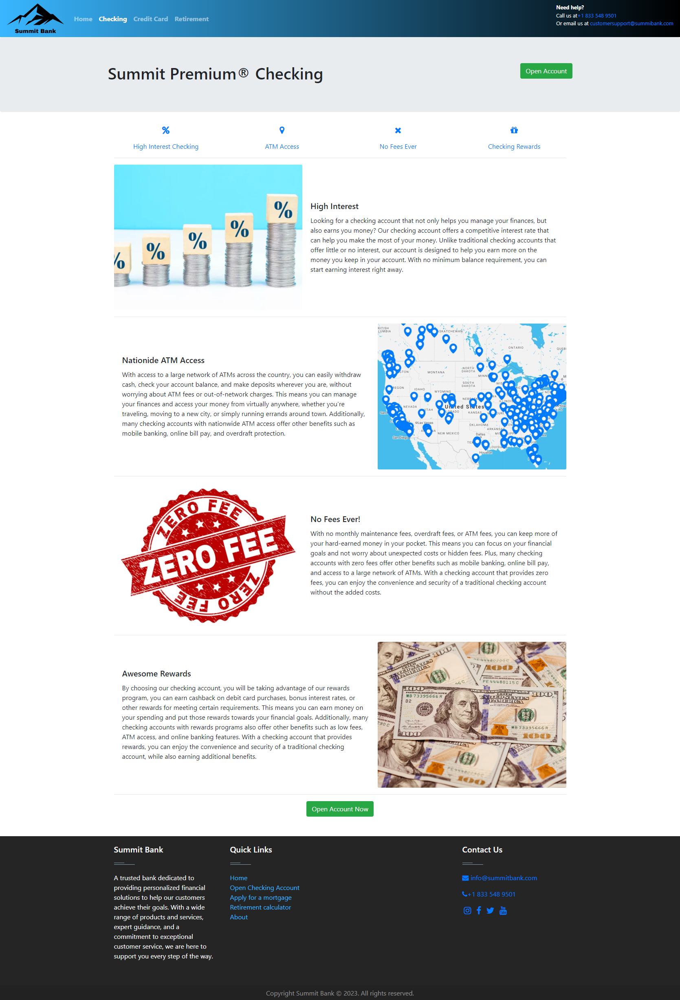
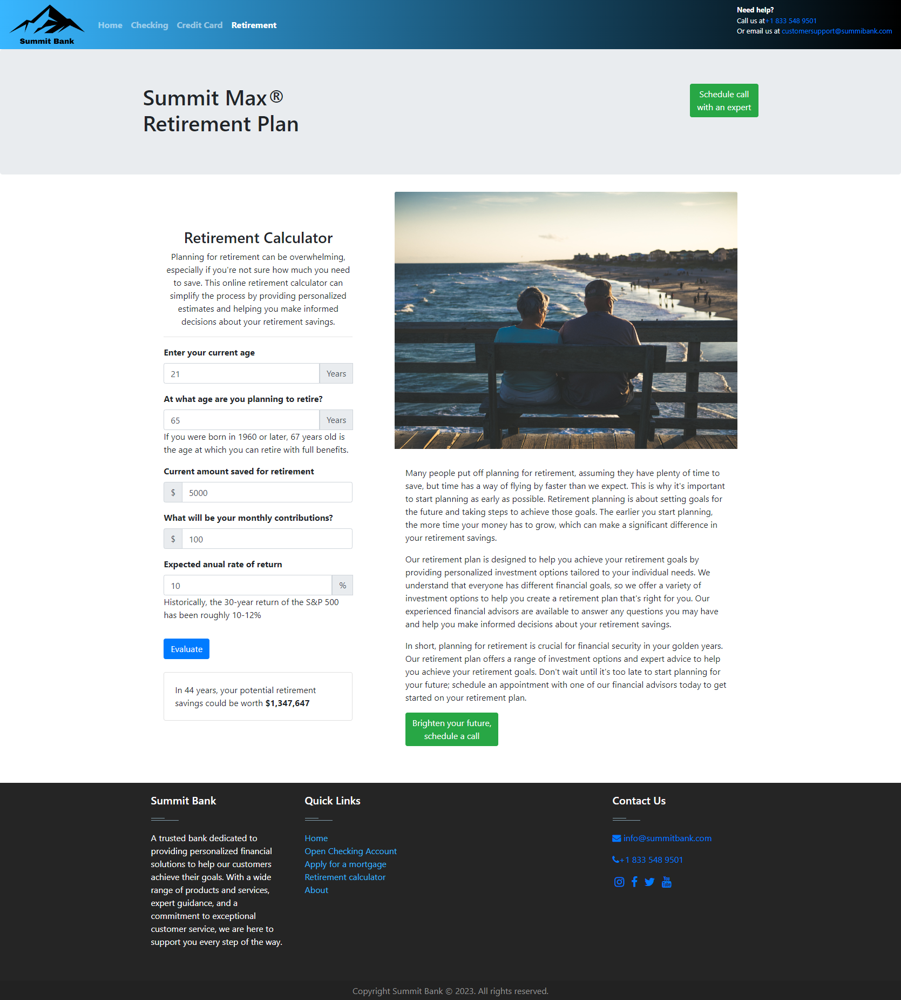

# Summit Bank Website

### This project consists of a landing page for a fictitious bank's website. It includes 4 different pages, all written in HTML with CSS styling. Bootstrap components are also implemented.

## Main features:
- The main page contains a carousel showing different products. There is an option to log in or create an account in the navbar.
- The other 3 pages contain descriptions for the different products: Checking Account, Savings, and Retirement.
- The Retirement page contains a Retirement Calculator powered by a JavaScript function that utilizes the DOM to connect to different user-inputted HTML elements. Once the user enters the required numbers, the JavaScript code performs a calculation and returns the final amount in dollars that the individual would have for retirement. The formula used is as follows:

```javascript
    const currentSavingsReturn = Math.trunc((currentSavings) * ((1) + (rateOfReturn / 12)) ** (12 * years));
    const contributionsReturn = Math.trunc((monthlyContributions * ((1 + rateOfReturn / 12) ** (12 * years) - 1)) / (rateOfReturn / 12));
    const totalReturns = currentSavingsReturn + contributionsReturn;
```

### Screenshot of the Home Page:


## Screenshot of the CheckingPage:



## Screenshot of the Retirment page, showing the functionality of the Retirement Calculator:


